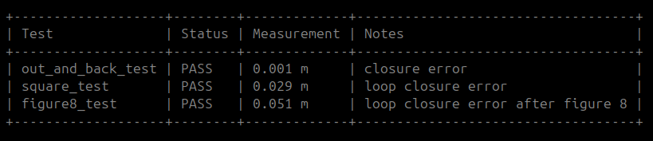
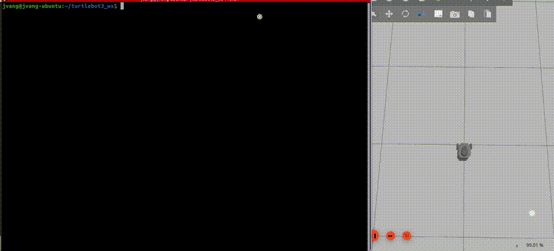
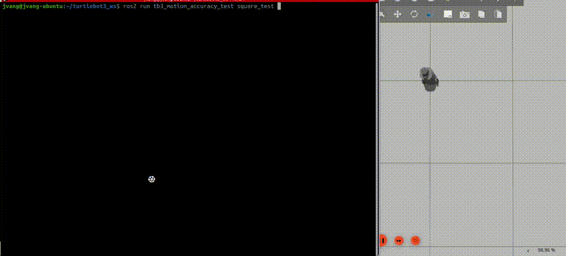
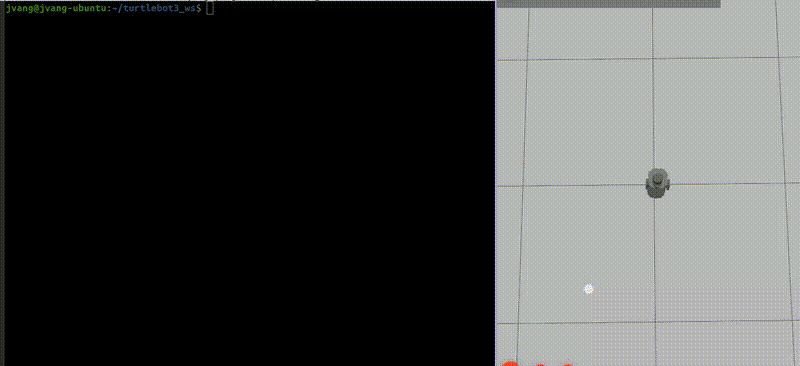

# tb3_motion_accuracy_test

A ROS 2 (Jazzy) motion accuracy validation suite for TurtleBot3 using closed-loop odometry-based trajectory tests.

This package evaluates how accurately a robot can execute real-world motion patterns and return to its starting position.

---

## Overview

This package contains three motion accuracy tests:

| Test | Description |
|-----|-------------|
| `out_and_back_test` | Move forward, rotate 180°, return to start and measure closure error |
| `square_test` | Drive a square path and measure loop closure error |
| `figure8_test` | Drive a figure-8 path to evaluate symmetry and accumulated drift |

---

## Demo

Example run of the motion accuracy tests:

<p align="center">
  
</p>

<p align="center">
  
</p>

### Out and Back Test

```bash
ros2 run tb3_motion_accuracy_test out_and_back_test
```

<p align="center">
  
</p>

### Square Test

```bash
ros2 run tb3_motion_accuracy_test square_test
```

<p align="center">
  
</p>

### Figure 8 Test

```bash
ros2 run tb3_motion_accuracy_test figure8_test
```

<p align="center">
  
</p>

All tests operate directly on:

```
/cmd_vel
/odom
```

This isolates and validates the motion pipeline:

```
cmd_vel → motor controller → wheels → encoders → odom
```

---

## Why This Matters

Even if a robot executes commands correctly, small motion errors accumulate over time.

These errors directly impact:

- Nav2
- AMCL
- SLAM
- Path tracking
- Autonomous navigation reliability

This package provides a measurable way to evaluate base motion accuracy before debugging higher-level systems.

---

## Installation

Clone into a ROS 2 workspace:

```bash
cd ~/your_ros2_ws/src
git clone https://github.com/johnnyjvang/tb3_motion_accuracy_test.git
```

Build the workspace:

```bash
cd ~/your_ros2_ws
colcon build
source install/setup.bash
```

---

## Running on Real TurtleBot3

Terminal 1:

```bash
source /opt/ros/jazzy/setup.bash
export TURTLEBOT3_MODEL=burger
ros2 launch turtlebot3_bringup robot.launch.py
```

Terminal 2:

```bash
cd ~/your_ros2_ws
source install/setup.bash
```

Run a single test:

```bash
ros2 run tb3_motion_accuracy_test square_test
```

Run the full suite:

```bash
ros2 launch tb3_motion_accuracy_test motion_accuracy_all.launch.py
```

---

## Running in Simulation

Terminal 1:

```bash
source /opt/ros/jazzy/setup.bash
export TURTLEBOT3_MODEL=burger
ros2 launch turtlebot3_gazebo empty_world.launch.py
```

Terminal 2:

```bash
cd ~/your_ros2_ws
source install/setup.bash
```

Run the full suite:

```bash
ros2 launch tb3_motion_accuracy_test motion_accuracy_all.launch.py
```

---

## Expected Results

### Out and Back Test

Robot should return close to the starting point:

```
Final position error: ~0.0 – 0.05 m
```

### Square Test

After completing 4 sides and 4 turns:

```
Loop closure error: ~0.03 – 0.10 m
```

### Figure 8 Test

Tests continuous curvature and symmetry:

```
Loop closure error: ~0.05 – 0.15 m
```

---

## Diagnostic Guide

| Observation | Possible Cause |
|-------------|---------------|
| Very low error (<0.01 m) | Excellent calibration |
| High drift in square test | Rotation error accumulation |
| Figure 8 asymmetry | Left/right wheel imbalance |
| Large out-and-back error | Encoder scaling issue |
| Curved trajectory when moving straight | Mechanical misalignment |
| Distorted figure 8 path | Velocity tuning mismatch |

---

## Expected Output

| Test              | Status | Measurement | Notes                     |
|------------------|--------|------------|---------------------------|
| out_and_back_test | PASS   | 0.002 m    | final position error      |
| square_test       | PASS   | 0.045 m    | loop closure error        |
| figure8_test      | PASS   | 0.081 m    | loop closure error        |

---

## Package Structure

```
tb3_motion_accuracy_test/
├── launch/
│   └── motion_accuracy_all.launch.py
├── docs/
│   ├── launch_output.png
│   ├── launch.gif
│   ├── out_and_back.gif
│   ├── square_test.gif
│   └── figure8.gif
├── tb3_motion_accuracy_test/
│   ├── out_and_back_test.py
│   ├── square_test.py
│   ├── figure8_test.py
│   ├── reset_results.py
│   ├── summary_report.py
│   └── result_utils.py
├── package.xml
├── setup.py
└── setup.cfg
```

---

## License

Apache License 2.0
